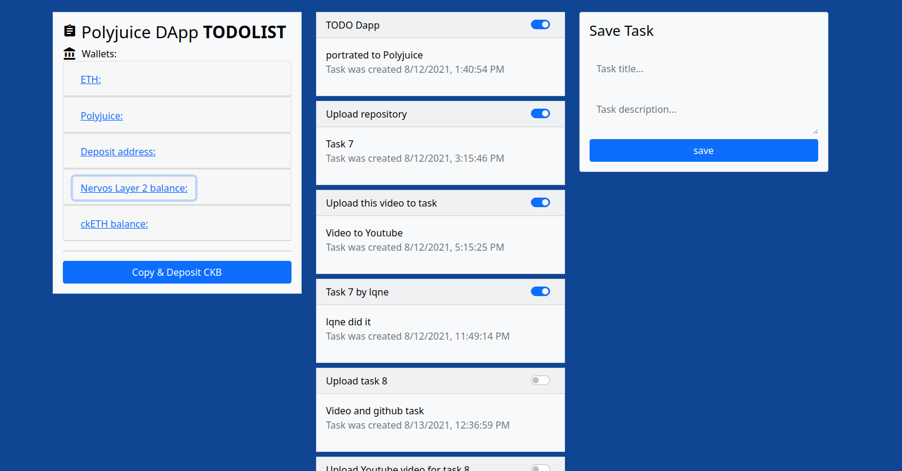

# TODOLIST DAPP PORTRATED TO POLYJUICE

[Original repository - blockchain-ethereum-contract](https://github.com/AndrewJBateman/blockchain-ethereum-contract)

## :books: How to use:
* get your ETH private key
* setup godwoken network at metamask:

* create  `.env` file and add next lines: 
`PRIVATE_KEY='YOUR_PRIVATE KEY_FROM_METAMASK'`
`WEB3_PROVIDER_URL='https://godwoken-testnet-web3-rpc.ckbapp.dev'`
`ROLLUP_TYPE_HASH='0x4cc2e6526204ae6a2e8fcf12f7ad472f41a1606d5b9624beebd215d780809f6a'`
`ETH_ACCOUNT_LOCK_CODE_HASH='0xdeec13a7b8e100579541384ccaf4b5223733e4a5483c3aec95ddc4c1d5ea5b22'`
* `truffle migrate --network godwoken` to compile app
* next add main logic contract address and SUDT contract address  to `./client/config.js`
* `npm run dev` for a server-lite dev server

## :camera: Screenshots

